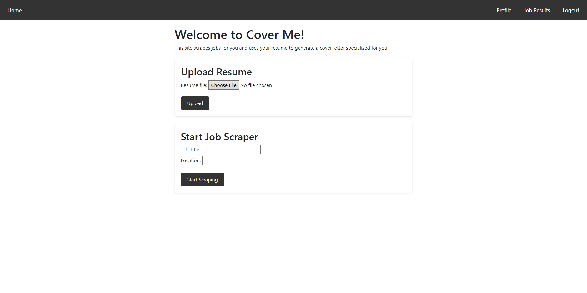
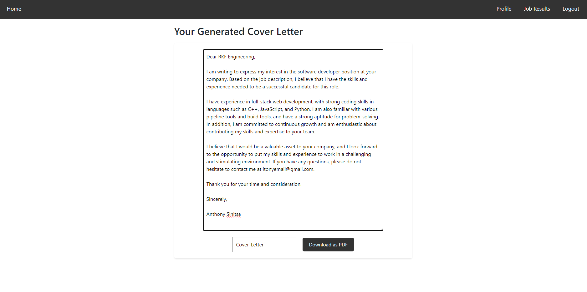
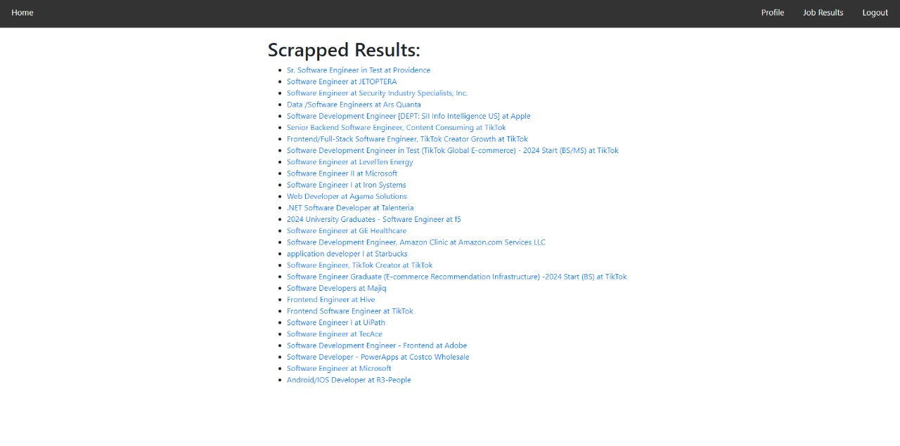
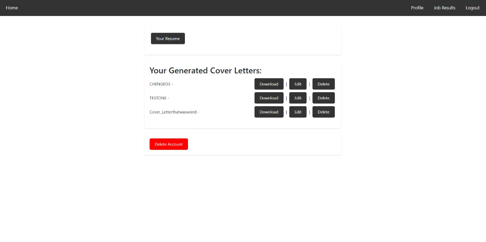

# Cover-My-Resume

Cover My Resume is a webstite that utilizes AI and other tools generate a specialized cover letter using a scrapped job description of your choosing and your inputted resume.






## SETUP

```,
To test scraper on your machine you MUST use poetry, first create a superuser:

$ pip install poetry

$ python manage.py makemigrations

$ python manage.py migrate

$ python manage.py createsuperuser

Must export you SCRAPFLY_KEY:

$ export $SCRAPFLY_KEY="your key from https://scrapfly.io/dashboard"

This next command will start the scraper:

$ poetry run python web_app/scrapers/indeed_scraper/run.py --job_description "Python Developer" --location "Seattle" --user_id "1"

If you get an error about a PYTHONPATH use this next command:

$ export PYTHONPATH=/your/project/level_root/cover-me-resume:$PYTHONPATH

###############################

TO RUN THE WEBSITE

You must use 3 terminals. NOTE: this project uses Google Cloud Services, this happens to me so it might happen to you but it might not, when you activate terminal 1 and 3 you might get an error about a GC_CREDENTIALS, if this is the case you must export the GCS env variables:

$ export DEFAULT_FILE_STORAGE=''

$ export GS_BUCKET_NAME=''

$ export GS_CREDENTIALS=''

$ export GS_PROJECT_ID=''

and for good measures:

$ export $SCRAPFLY_KEY="your key from https://scrapfly.io/dashboard"

Terminal 1: 

$ python manage.py runserver

Terminal 2:

$ redis-server

Terminal 3:

$ celery -A cover_me worker --loglevel=info
```

## Making changes and deploying to production

1. Make any necessary changes

2. add and commit the changes

3. push the changes to github

4. push the changes to heroku using this command:

5. $ git push heroku main

## LICENSE

[license](LICENSE.md)
